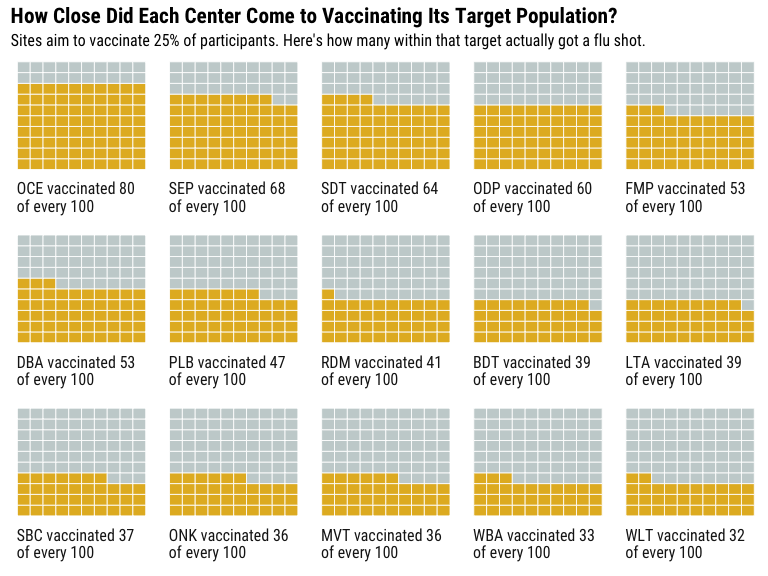

Extra Credit Assignment \#2
================
Sarah Ligon
10/2/22

Meet Figure 2.11 from [*Storytelling With
Data*](https://www.oreilly.com/library/view/storytelling-with-data/9781119621492/).
It’s trying to convey some information about what happened at different
sites who took part in a flu vaccination campaign.


To start exploring the story inside this chart, let’s load some
libraries —

``` r
library(readxl)     # imports .xlsx spreadsheets into R
library(janitor)    # cleans up variable names 
library(tidyverse)  # dplyr, tidyr, & ggplot2
library(knitr)      # cleaner tables
library(waffle)     # tastier alternative to pie charts
```

— and import the Excel spreadsheet from our class folder (I cut and
pasted the table values into a separate tab labelled “raw”).

``` r
raw_vax <- read_excel("data/Copy of 2.11 EXERCISE.xlsx", sheet = "raw") %>%
  clean_names()
```

A lot of the variables are labelled weirdly (what’s “success percent”?),
and the “average” line lacks context. The author’s also been encouraging
us to double-check accuracy, so let’s take a look.

``` r
raw_vax %>% summarize(
  mean = 100*(mean(success_percent)),
  median = 100*(median(success_percent)),
  min = 100*(min(success_percent)),
  max = 100*(max(success_percent))
) %>% 
  kable(digits = 2)
```

|  mean | median |  min |   max |
|------:|-------:|-----:|------:|
| 11.98 |  11.04 | 7.96 | 19.98 |

As suspected, the line labelled “average” in the original figure doesn’t
accurately represent either the mean or median of vaccination rates
across sites represented in this dataset. We can generate some variables
to check what else might be more interesting.

Clearly there’s a lot of variance among participant populations between
sites. I’m also curious about whether some sites gave out a discrepantly
high percentage of total vaccines administered cross-cohort.

``` r
vax <- raw_vax %>% 
  select(-average) %>% 
  filter(center != "TOTAL") %>% 
  rename(n_vaxxed = vaccines,
         vax_rate = success_percent, 
         pop = opportunities) %>% 
  relocate(pop, .after = center) %>% 
  mutate(unvaxxed_rate = 1 - vax_rate,
         n_unvaxxed = pop * unvaxxed_rate,
         t10 = 0.10,
         n_t10 = t10 * pop,
         t25 = 0.25,
         n_t25 = t25 * pop,
         t25_vax_prop = n_vaxxed/n_t25,
         t25_shortfall = n_t25 - n_vaxxed,
         center = factor(center),
         tot_vaccines = sum(n_vaxxed),
         ctr_pct_tot_vaccines = n_vaxxed/tot_vaccines)
```

Not pictured: a bunch of quick experimental peeks at different ways of
comparing proportions within and between the sites. Were I spending more
time on the set or drawing up a report, I’d start by showing the
variance in participant populations across sites, along with a stacked
bar chart showing vaccination proportions by site.

Since the average was still bugging me, however, I thought about what
might be most useful for our audience, and came back to the idea of
targets. Let’s say, as the textbook at one point suggests, that each
center aims to vaccinate 25% of its participant population (i.e. the
subset represented by n_t25 in our vax df.) I’ve been wanting to play
with [this waffle chart package](https://github.com/hrbrmstr/waffle), so
let’s see if we can visualize how well each site did at getting just
that 25% fully vaccinated.

The waffle package wants data to be long, not wide, so I pulled it into
shape with the tidyr::pivot_longer function.

``` r
wafflemaker <- vax %>%
  mutate(
    w2_labs = paste0(center, " vaccinated ", round(t25_vax_prop*100), " of every 100"),
    vaccinated = n_vaxxed,
    unvaccinated = t25_shortfall,
    .keep = "all") %>% 
  select(w2_labs, center, n_vaxxed, t25_shortfall, t25_vax_prop) %>% 
  pivot_longer(3:4, names_to = "status", values_to = "obs") %>% 
  mutate(status = factor(status),
         w2_labs = factor(w2_labs))
```

And now we can graph it. Labels turned out to be a pain in the waffle
package syntax; realistically, I’d go in and adjust this in something
like Illustrator after the fact (especially to give each site’s target
achievement some emphasis). I wrestled with chart size rendering in R
Markdown .html output until I found [this
section](https://r4ds.had.co.nz/graphics-for-communication.html#figure-sizing)
in Hadley Wickham’s *R for Data Science*.

``` r
wafflemaker %>%
  mutate(w2_labs = fct_reorder(w2_labs, t25_vax_prop, .desc = TRUE)) %>% 
  ggplot(aes(fill = status, values = obs))+
  geom_waffle(color = "white", 
              size = 0.3, 
              flip = TRUE,
              nrows = 20,
              make_proportional = TRUE,
              alpha = .9)+
  scale_fill_manual(values = c("#E1AF00", "azure3"), guide = "none")+
  theme_enhance_waffle()+
    facet_wrap(~w2_labs,
               nrow = 3,
               scales = "free",
               strip.position = "bottom",
               labeller = label_wrap_gen(width = 18, multi_line = TRUE))+
  labs(title = "How Close Did Each Center Come to Vaccinating Its Target Population?",
     subtitle = "Sites aim to vaccinate 25% of participants. Here's how many within that target actually got a flu shot.")+ 
  theme(strip.text.x = element_text(hjust = 0, size = 12, family = "Roboto Condensed"),
        plot.title = element_text(size = 16, face = "bold", family = "Roboto Condensed"),
        plot.subtitle = element_text(size = 12, family = "Roboto Condensed"),
        axis.ticks = element_blank(),
        strip.background = element_blank(),
        panel.background = element_blank())
```


